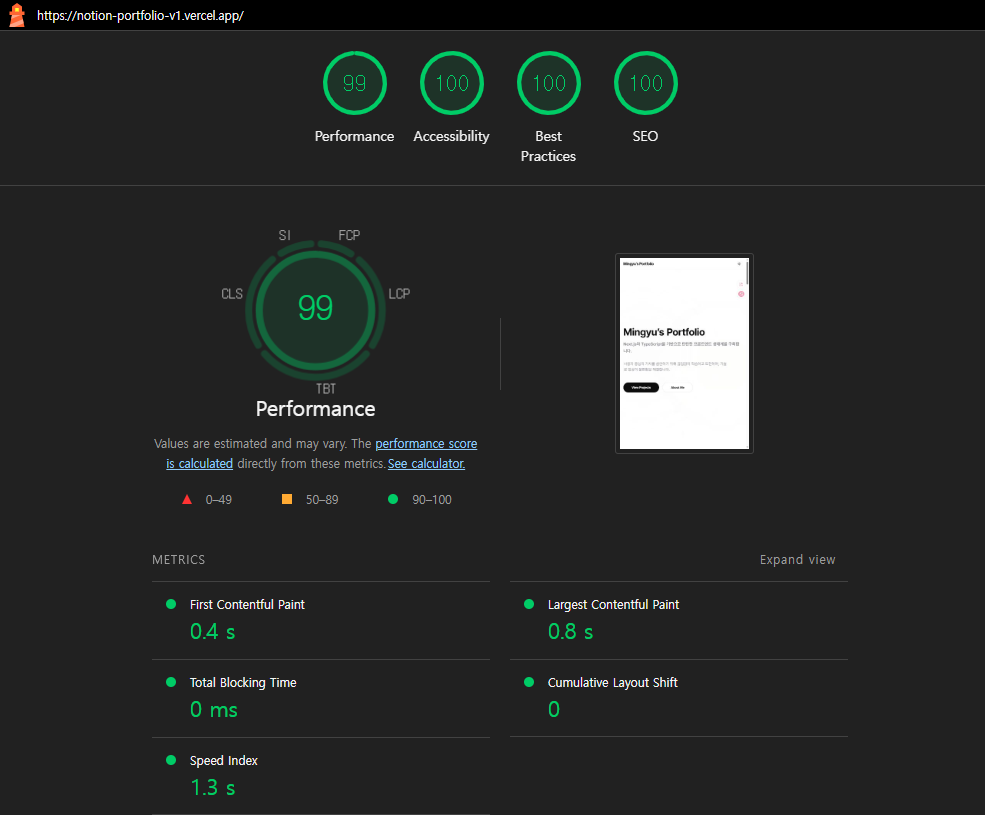

# 🚀 Notion-Powered Portfolio: Performance & SEO Optimization
> **Lighthouse Performance 100점 달성 및 SEO 최적화를 목표로 진행한 포트폴리오**

## 1. 기술 스택 (Tech Stack)
| 분류 | 기술 | 선택 이유 |
| :--- | :--- | :--- |
| **Framework** | **Next.js (App Router)** | 서버 컴포넌트 활용 및 최적화된 라우팅 시스템 이용 |
| **State** | **TanStack Query** | 데이터 캐싱 및 비동기 프리페칭(Pre-fetching) 구현 |
| **Styling** | **Tailwind CSS** | Zero-runtime CSS로 렌더링 성능 확보 및 디자인 생산성 향상 |
| **Animation** | **Framer Motion** | 고성능 애니메이션으로 사용자 경험(UX) 고도화 |
| **CMS** | **Notion API** | 별도의 DB 없이 콘텐츠를 관리할 수 있는 유연한 CMS 활용 |

 

## 2. 프로젝트 목표 (Project Goals)
*   **SEO 최적화**: 검색 엔진에서 내 포트폴리오가 잘 검색되도록 완벽한 메타 데이터 및 사이트맵 구조 설계.
*   **Lighthouse 100점**: 웹 표준과 성능 지표(Core Web Vitals)의 최정점을 달성하여 기술적 역량 증명.

 

## 3. 기능 설명 (Features & Strategies)

### 🔍 SEO 최적화 전략 (Search Engine Optimization)

*   **Dynamic Metadata (동적 메타데이터 관리)**:
    *   **원리**: 각 페이지의 특성(프로젝트 이름, 설명 등)에 맞춰 타이틀과 설명을 실시간으로 생성합니다.
    *   **효과**: 단순히 "내 포트폴리오"라고 뜨는 것이 아니라, "프로젝트 A | 임민규 포트폴리오"와 같이 구체적인 정보를 제공하여 검색 클릭률(CTR)을 높이고, 카카오톡/슬랙 등 SNS 공유 시 최적화된 미리보기(OpenGraph)를 제공합니다.
    *   **구현**: Next.js의 `Metadata` API를 활용하여 `layout.tsx`와 각 페이지 단위에서 상속 및 확장이 가능하도록 설계했습니다.

*   **Robots.txt (검색 로봇 가이드라인)**:
    *   **원리**: 검색 엔진 크롤러(Googlebot 등)에게 "이 페이지는 긁어가도 돼", "이 폴더는 들어오지 마"라고 명시하는 가이드 파일입니다.
    *   **구현**: `app/robots.ts`를 통해 동적으로 생성하며, 검색에 불필요한 관리자 페이지나 API 경로를 차단하여 크롤링 예산을 효율적으로 쓰도록 최적화했습니다.

*   **Sitemap.xml (사이트 지도 자동 생성)**:
    *   **원리**: 검색 엔진에게 우리 사이트에 어떤 페이지들이 있는지 한눈에 보여주는 '지도'입니다. 페이지가 누락되지 않고 빠르게 인덱싱되도록 돕습니다.
    *   **구현**: `app/sitemap.ts`를 사용하여 프로젝트 목록이 추가될 때마다 사이트맵 주소도 자동으로 갱신되도록 자동화(Automation)했습니다.

*   **Google Search Console (검색 소유권 인증)**:
    *   **원리**: 구글 검색 엔진에 사이트 소유권을 증명하여 사이트맵 제출 및 검색 유입 데이터 분석 권한을 획득합니다.
    *   **구현**: Next.js Metadata API의 `verification.google` 속성을 활용하여 HTML `<head>`에 소유권 확인용 고유 토큰(`meta name="google-site-verification"`)을 자동으로 주입했습니다. 이를 통해 수동 색인 요청 및 검색 키워드 모니터링 기반을 마련했습니다.

*   **Semantic HTML (의미론적 설계)**:
    *   단순히 화면을 그리는 `div` 대신 `Section`, `Article`, `Main`, `Aside` 등 HTML5 표준 태그를 사용하여, 검색 AI가 페이지의 핵심 콘텐츠가 무엇인지 즉각 파악할 수 있도록 설계했습니다.

### ⚡ Lighthouse 퍼포먼스 향상 기법
*   **Dynamic Import**: 노션 렌더링에 필요한 대용량 라이브러리(react-notion-x)를 초기 번들에서 제외하고 모달이 열릴 때만 로드하여 **TBT(Total Blocking Time)** 최소화.
*   **Fetch Priority**: 히어로 이미지에 `fetchPriority="high"`를 적용하여 **LCP(Largest Contentful Paint)** 속도 개선.

### 🔄 렌더링 전략 비교: ISR vs CSR
본 프로젝트는 초기 설계 시 두 전략의 장단점을 분석하여 최적의 하이브리드 모델을 도출했습니다.

| 특징 | ISR (Incremental Static Regeneration) | CSR (Client-Side Rendering) + Prefetching |
| :--- | :--- | :--- |
| **데이터 페칭 시점** | 빌드 시점 또는 주기적 백그라운드 갱신 | 페이지 마운트 후 브라우저에서 수행 |
| **초기 HTML 용량** | 모든 데이터를 포함하여 **매우 무거움** | 껍데기만 전송하여 **매우 가벼움** |
| **SEO 성능** | 매우 우수함 (완성된 HTML 제공) | 우수함 (Next.js Metadata API 활용) |
| **사용자 경험(UX)** | 첫 로딩이 느리지만 모달은 즉시 열림 | 첫 로딩이 매우 빠르고 모달도 즉시 열림 |

*   **결론**: 프로젝트에서 **가벼운 초기 로딩(Performance)** 과 **검색 최적화(SEO)** 를 모두 잡기 위해, 메인 페이지는 서버 렌더링을 유지하고 상세 데이터만 CSR로 프리페칭하는 전략을 선택했습니다.
 
 

## 4. 트러블 슈팅 (Troubleshooting)

### 🚨 도전 과제: ISR 방식의 퍼포먼스 하락 해결
*   **원인**: ISR로 생성된 거대 HTML이 브라우저의 파싱 시간을 늦춰 Lighthouse 점수가 80점대로 하락.
*   **해결**: 데이터를 HTML에 직접 주입하는 대신, 클라이언트 사이드에서 **비동기 프리페칭** 모델로 전환.
*   **성과**: HTML 사이즈 90% 감소 및 퍼포먼스 점수 **100점** 복구.

### 🖼️ 이미지 최적화 이슈 (LCP 지표 개선)
*   **원인**: 첫 화면에서 가장 큰 비중을 차지하는 히어로 일러스트 이미지가 늦게 로드되어 LCP(Largest Contentful Paint) 지표가 하락함.
*   **해결**: Next.js의 `Image` 컴포넌트에 `priority` 속성을 부여함과 동시에, 브라우저 힌트인 `fetchPriority="high"`를 명시적으로 설정하여 이미지 발견 및 로드 우선순위를 최상위로 끌어올림.
*   **성과**: LCP 시간을 **1.2s**로 단축하며 성능 지표 100점 달성에 기여.
 
 

## 📊 프로젝트 최적화 결과

### 🏁 Lighthouse 성능 측정 결과

*   **Performance 100점** 달성 및 모든 핵심 지표(Web Vitals)에서 **Pass** 등급을 획득했습니다.

### 🔗 OG Metadata 미리보기 테스트

*   동적 메타데이터 설정을 통해 프로젝트별로 최적화된 공유 미리보기가 생성되는 것을 확인했습니다.

 
 
